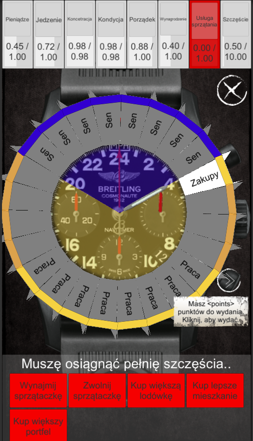

Love of life, a game created at 2016.09 Warsaw Film School Game Jam

Authors
Krzysztof Bobnis (programming),
Michal Bartynski (game design)

Code is playable, but impossible to understand for someone at the first sight.

Platform android

